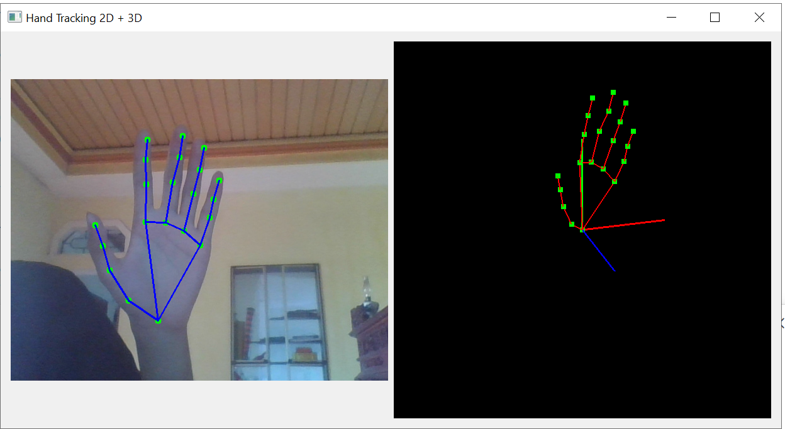
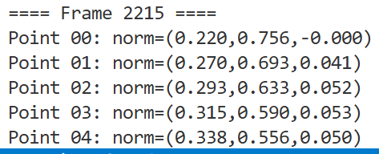
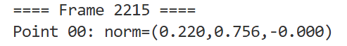

# 🖐️ Hand Tracking 2D + 3D (MediaPipe + OpenCV + PyOpenGL)

## 📌 Giới thiệu

Project này sử dụng **MediaPipe** để nhận diện bàn tay theo thời gian thực từ webcam, kết hợp:

* 🟢 OpenCV → hiển thị tracking 2D
* 🔵 PyOpenGL → hiển thị mô hình tay 3D
* 🟡 PyQt5 → giao diện người dùng

👉 Kết quả:

* Theo dõi bàn tay realtime
* Hiển thị landmark 2D + 3D
* Có smoothing giúp chuyển động mượt hơn
* Giao diện trực quan: Chia đôi màn hình (2D bên trái, 3D bên phải).

---

## 🎥 Demo



- Có thể nhấn và giữ chuột trái ở màn hình 3D (màn bên phải) để thay đổi góc nhìn.

---

## 📁 Cấu trúc project

```
.
├── model/
│   └── hand_landmarker.task
├── config.py
├── draw.py
├── draw3D.py
├── handtracking.py
├── Tracker.py
├── ui.py
├── main.py
├── requirements.txt
└── .gitignore
```

- `model/`: Chứa file model MediaPipe (`hand_landmarker.task`).

- `config.py`: Các thông số cài đặt (Camera ID, Smoothing, Model path).

- `draw.py`: Vẽ các landmark và kết nối lên khung hình 2D.

- `draw3D.py`: Xử lý vẽ bàn tay trong không gian 3D sử dụng OpenGL.

- `handtracking.py`: Xử lý logic MediaPipe và thuật toán làm mượt.

- `Tracker.py`: Lớp trung gian điều phối dữ liệu từ MediaPipe sang UI.

- `ui.py`: Quản lý giao diện người dùng chính (PyQt5).

- `main.py`: Điểm khởi chạy ứng dụng.

- `requirements.txt`: Chứa thư viện python

- `.gitignore`: Cấu hình để đưa lên git thôi. Ae không phải quan tâm.


---

## ⚙️ Cài đặt

### 1. Clone repo

```bash
git clone https://github.com/your-username/your-repo.git
```

### 2. Tạo môi trường ảo (khuyến nghị)
- Python version: `Python 3.14.4`

```bash
python -m venv .venv
.venv\Scripts\activate
```

### 3. Cài thư viện

```bash
pip install -r requirements.txt
```

---

## ▶️ Chạy chương trình

```bash
python main.py
```
- Xem 2D: Nhìn vào camera, hệ thống sẽ tự động vẽ các điểm xương tay.

- Xem 3D: Ở khung hình bên phải, bạn có thể nhấn giữ chuột và kéo để xoay mô hình bàn tay 3D.

- Cấu hình: Bạn có thể thay đổi `CAMERA_ID` hoặc độ mượt `SMOOTHING` trong file `config.py`.

---

## 🔧 Cấu hình

Trong `config.py`:

| Tham số | Ý nghĩa | 
|--------------|-------|
| `MODEL_PATH` | Đường dẫn đến file `.task` của MediaPipe | 
| `NUM_HANDS` | Số lượng bàn tay tối đa có thể nhận diện | 
| `CAMERA_ID` | Index của camera (thường là 0 cho Webcam) |
| `SMOOTHING` | Chỉ số làm mượt (0.0 đến 1.0) |

## Chú ý



- Trong Terminal sẽ hiện tọa độ normalzed space trong MediaPipe. Về cơ bản đây là tỉ lệ vị trí trong ảnh.
- ví dụ: 
  

  - Frame thứ 2215
  - Điểm 0 có vị trí:
    - X = 0.22 (0.0 là mép trái, 1.0 là mép phải của khung hình.)
    - Y = 0.756 (0.0 là mép trên, 1.0 là mép dưới.)
    - Z = 0 (gần camera hơn thì âm, xa camera hơn thì dương)

- Trong đó điểm 0, điểm 1, điểm 2, ... là các điểm trên bàn tay như trong hình vẽ:
  
  
